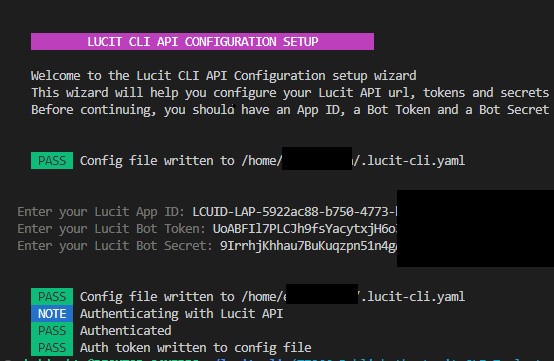
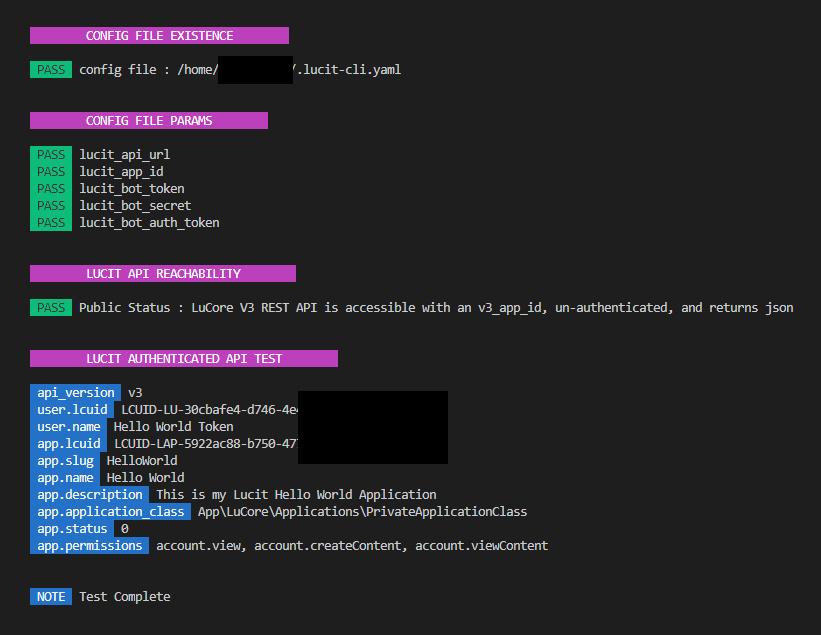

# Lucit CLI
A command line tool, written in go, for testing the Lucit API.

This tool requires a Lucit Application ID, an Authorization Token and a Secret

# Purpose
This tool allows 3rd party application developers to perform basic API calls to the Lucit API for testing their app id's, tokens, etc.

# API and Developer Documentation

- **Lucit Developer documentation** https://lucit.cc/developers
- **Complete Lucit API reference** https://apidocs.lucit.app

# Notes
This tool is built upon the following open source libraries

- **Cobra** CLI Framework https://github.com/spf13/cobra
- **Cobra CLI** for automating tasks related to generating commands - https://github.com/spf13/cobra-cli
- **Viper** For reading and writing config files - https://github.com/spf13/viper

# Pre-Reqs

**Golang**
Lucit CLI is built on golang.  You will need to have `go` installed - https://go.dev/doc/install

This should be cross platform compatible on Linux, Windows and MacOS

**Application Id**
To use the Lucit API - You need an Application ID from the Lucit App you created.

For more information on building a Lucit app and getting your Application ID
See https://www.lucit.cc/developers/applications

**Bot User and Secret**
To access to the API, you need to generate a token user and secret.
Tokens are created underneath the "TOKENS" tab of your application

Learn more about creating tokens and secrets at https://www.lucit.cc/post/creating-lucit-application-tokens

# Installation and Setup

**1. Clone the this Repo**
Clone this repo to a local directory on your machine

```
git clone https://github.com/lucit-cc/lucit-cli.git
```

**2. Initialize your Application**

```
go run main.go init
```





**3.  Test your Settings**

```
go run main.go test
```




**4. Make your first API call**


```
go run main.go get /status
```

The response should look something like the following json

```json
{
  "api_version": "v3",
  "app": {
    "application_class": "App\\LuCore\\Applications\\PrivateApplicationClass",
    "application_class_description": "Only you and other members of this application can add it to accounts",
    "created_at": "2024-01-16T20:42:43.000000Z",
    "description": "This is my Lucit Hello World Application",
    "lcuid": "LCUID-LAP-5922ac88-****-*****-*****************",
    "name": "Hello World",
    "options": {
      "allowed_permissions_at_version": {
        "1": [
          "account.view"
        ],
        "2": [
          "account.view",
          "account.createContent"
        ],
        "3": [
          "account.view",
          "account.createContent",
          "account.viewContent"
        ]
      },
      "permissions": null,
      "permissions_version": 3,
      "primary_image_public_url": null
    },
    "organization_name": null,
    "permissions": {
      "allowed": [
        "account.view",
        "account.createContent",
        "account.viewContent"
      ]
    },
    "slug": "HelloWorld",
    "status": 0,
    "updated_at": "2024-01-16T20:43:20.000000Z",
    "website": null
  },
  "app_id_required": true,
  "auth_required": true,
  "auth_user_id_sent": "LCUID-LU-30cbafe4-****-****-****-*****************",
  "message": "LuCore V3 REST API is accessible with an v3_app_id, un-authenticated, and returns json",
  "ok": true,
  "timestamp": 1705438447,
  "user": {
    "lcuid": "LCUID-LU-30cbafe4-****-****-****-*****************",
    "name": "Hello World Token"
  },
  "v3_app_id_sent": "LCUID-LAP-5922ac88-****-*****-*****************"
}
```


**5. Build a binary**

Build and install the `lucit-cli` binary

```
go install
```

**6. Use the Binary**

- `lucit-cli init`
- `lucit-cli test`
- `lucit-cli get /status`


# get

The `get` command simply accepts the endpoint that you are fetching and will return the JSON response from that endpoint

# post and put
These commands are NOT currently supported from this CLI tool.  The tool can only be used (currently) to make requests to GET endpoints


# Some quick Examples

Full documentation is available at https://apidocs.lucit.app/

Here are a few examples GET endpoints to try

**Accounts**
Get a list of accounts that have added your app

```
lucit-cli get /accounts
```

```json
{
  "accounts": [
    {
      "created_at": "2023-11-01T13:17:31.000000Z",
      "description": null,
      "lcuid": "LCUID-LA-****-****-****-****-*****",
      "name": "Coastline Auto (Eric)",
      "options": {
        "primary_image_background_removed_public_url": null,
        "primary_image_public_url": null
      },
      "slug": "CoastlineAutoEric",
      "website": null
    }
  ],
  "success": true
}

```


**Campaigns**
Get a list of campaigns that belong to your accounts

```
lucit-cli get /campaigns
```

```json

{
  "campaigns": [
    {
      "active": true,
      "build_status": 2,
      "campaign_class": "App\\LuCore\\Campaigns\\OperatorContractCampaignClass",
      "campaign_class_description": "Media Owner Contract",
      "campaign_state": 6,
      "campaign_state_changed_at": null,
      "created_at": "2023-11-01T13:22:02.000000Z",
      "hash_id": "lch-4Cd6",
      "last_build_at": "2024-01-16 21:02:07",
      "lcuid": "LCUID-LE-****-****-****-****-*****",
      "name": "Breezy Billboards"
    }
  ],
  "success": true
}
```


# More Information
View all of the Lucit developer documentation at https://www.lucit.cc/developers
